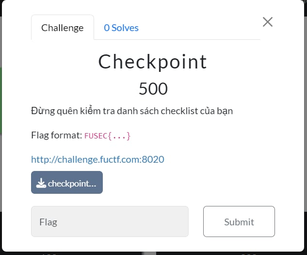
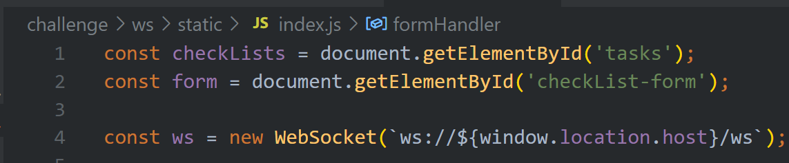
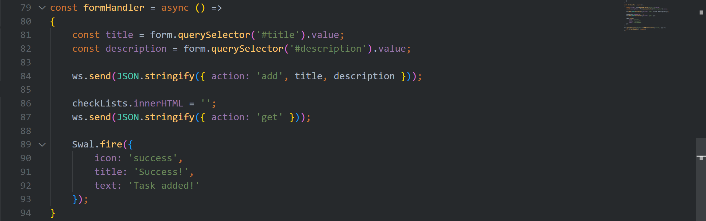
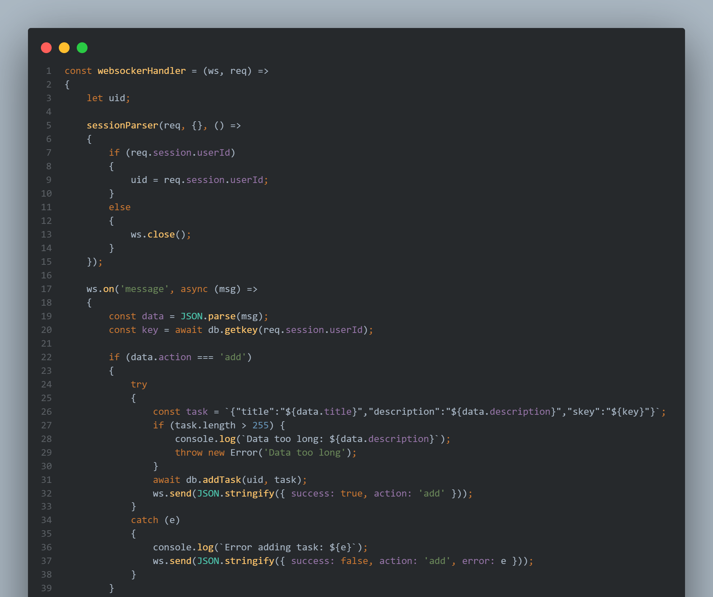
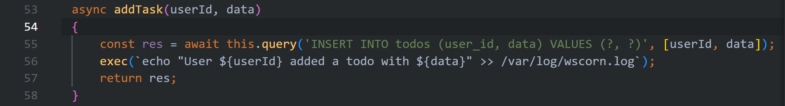
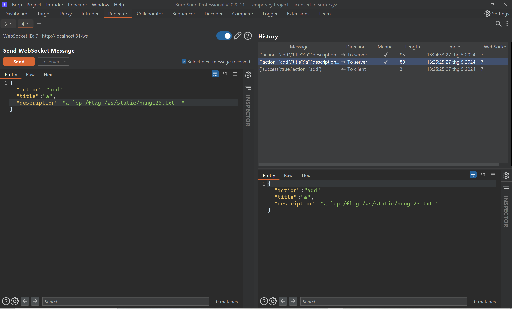
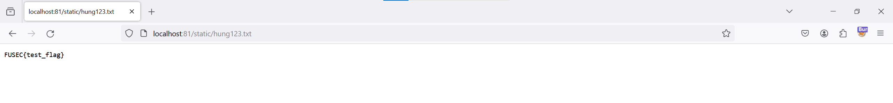
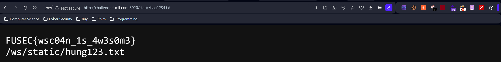

checkpoint

# 1. Brainstorm
## Hướng tiếp cận

Hướng tiếp cận là đi từ file index.js ở client-side tới wsHandler.js và database.js ở server-side

Ở index.js ta thấy rằng webapp này sử dụng websocket để trao đổi giữa client và server

Hàm formHandler là hàm lấy giá trị từ form và gửi tới websocket

Dữ liệu này sẽ được xử lý ở wsHandler.js 

#### Ở action là add thì trường description và title sẽ được nối chuỗi trực tiếp vào bằng Template Strings và không có filter gì cả → Có thể khai thác

#### Ta thấy biến task chứa data được nối chuỗi vào sẽ được truyền vào addTask bởi đối tượng db (instance của class database) → Nhảy tới database.js.

#### Khi vào database.js thì ta thấy task sẽ được truyền vào hàm exec() (1 hàm nguy hiểm) → Bingo

# 2. Exploit

## Payload

{"action":"add","title":"a","description":"a `cp /flag /ws/static/hung123.txt`"}

## Exploit ở local

## Exploit ở remote

